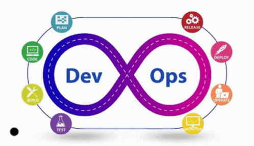

# Overview of CI/CD ♾️

`CI/CD, which stands for continuous integration and continuous delivery/deployment`, aims to streamline and accelerate the software development lifecycle.

> Continuous integration (CI) refers to the practice of automatically and frequently integrating code changes into a shared source code repository.

> Continuous delivery and/or deployment (CD) is a 2 part process that refers to the integration, testing, and delivery of code changes.

> Continuous delivery stops short of automatic production deployment.

> continuous deployment automatically releases the updates into the production environment.


## CI/CD Flow
```
    CICD Flow = CICD Pipelines
```
Taken together, these connected practices are often referred to as a `CI/CD pipeline` and are supported by development and operations teams working together in an agile way with either a DevOps or site reliability engineering (SRE) approach.

## Why is CI/CD important?
- avoids bugs
- maintains continuous SDLC cycle
- decrease complexity
- increase efficiency
- streamline workflows
- minimized downtimes
- faster code release
- positive outcomes for end users and customers since feedbacks are incorporated frequently.

As apps grow larger, features of CI/CD can help decrease complexity, increase efficiency, and streamline workflows.

Because CI/CD automates the manual human intervention traditionally needed to get new code from a commit into production, downtime is minimized and code releases happen faster. And with the ability to more quickly integrate updates and changes to code, user feedback can be incorporated more frequently and effectively, meaning positive outcomes for end users and more satisfied customers overall. 

## What is continuous integration (CI)?
The "CI" in CI/CD always refers to continuous integration.

> an automation process for developers that facilitates more frequent merging of code changes back to a shared branch. As these updates are made, automated testing steps are triggered to ensure the reliability of merged code changes. 

CI can be thought of as a solution to the problem of having too many branches of an app in development at once that might conflict with each other.

Successful CI means that once a developer’s changes to an application are merged, those changes are validated by automatically building the application and running different levels of automated testing, typically unit and integration tests.

## What is the “CD” in CI/CD?
The "CD" in CI/CD refers to continuous delivery and/or continuous deployment, which are related concepts that sometimes get used interchangeably. Both are about automating further stages of the pipeline, but they’re sometimes used separately to illustrate just how much automation is happening. The choice between continuous delivery and continuous deployment depends on the risk tolerance and specific needs of the development teams and operations teams.

### What is continuous delivery?
 Continuous delivery automates the release of validated code to a repository following the automation of builds and unit and integration testing in CI. So, in order to have an effective continuous delivery process, it’s important that CI is already built into your development pipeline.

Continuous delivery usually means a developer’s changes to an application are automatically bug tested and uploaded to a repository (like GitHub or a container registry), where they can then be deployed to a live production environment by the operations team. 

It’s an answer to the problem of poor visibility and communication between dev and business teams. 

the purpose of continuous delivery is to have a codebase that is always ready for deployment to a production environment, and ensure that it takes minimal effort to deploy new code.

### What is continuous deployment?
The final stage of a mature CI/CD pipeline is continuous deployment. 

Continuous deployment is an extension of continuous delivery, and can refer to automating the release of a developer’s changes from the repository to production, where it is usable by customers.

CD addresses the problem of overloading operations teams with manual processes that slow down app delivery. It builds on the benefits of continuous delivery by automating the next stage in the pipeline.

In practice, continuous deployment means that a developer’s change to a cloud application could go live within minutes of writing it (assuming it passes automated testing). This makes it much easier to continuously receive and incorporate user feedback.

### CI/CD vs DevOps


CI/CD is an essential part of DevOps methodology, which aims to foster collaboration between development and operations teams. Both CI/CD and DevOps focus on automating processes of code integration, thereby speeding up the processes by which an idea (like a new feature, a request for enhancement, or a bug fix) goes from development to deployment in a production environment where it can provide value to the user.

In the collaborative framework of DevOps, security is a shared responsibility integrated from end to end. It’s a mindset that is so important, it led some to coin the term "DevSecOps" to emphasize the need to build a security foundation into DevOps initiatives. 

**DevSecOps** (development, security, and operations) is an approach to culture, automation, and platform design that integrates security as a shared responsibility throughout the entire IT lifecycle. A key component of DevSecOps is the introduction of a secure CI/CD pipeline.

### What is CI/CD security?
CI/CD security is used to safeguard code pipelines with automated checks and testing to prevent vulnerabilities in software delivery. Incorporating security into your pipeline--via methods like shift left and shift right security--helps to protect code from attack, prevent data leaks, comply with policies, and ensure quality assurance.

The rapid nature of development and deployment without proper security can expose the pipeline to risks, such as:

Exposure of sensitive data to outside sources
Use of insecure code or third party components
Unauthorized access to source code repositories or build tools
Identifying and mitigating vulnerabilities throughout the software development cycle assures that code changes are thoroughly tested and adhere to security standards before being deployed to production.

### What are some common CI/CD tools?
CI/CD tools can help a team automate their development, deployment, and testing. Some tools specifically handle the integration (CI) side, some manage development and deployment (CD), while others specialize in continuous testing or related functions.

`1. Tekton Pipelines` is a CI/CD framework for Kubernetes platforms that provides a standard cloud-native CI/CD experience with containers.

`2. Jenkins`, designed to handle anything from a simple CI server to a complete CD hub

`3. Spinnaker`, a CD platform built for multicloud environments.

`4. GoCD`, a CI/CD server with an emphasis on modeling and visualization.

`5. Concourse`, "an open-source continuous thing-doer."
`6. Screwdriver`, a build platform designed for CD.

Teams may also want to consider `managed CI/CD tools`, which are available from a variety of vendors. The major public **cloud providers** all offer CI/CD solutions, along with `GitLab`, `CircleCI`, `Travis CI`, `Atlassian Bamboo`, and many others.

*Additionally, any tool that’s foundational to DevOps is likely to be part of a CI/CD process*. Tools for configuration automation (such as `Ansible`, `Chef`, and `Puppet`), container runtimes (such as `Docker`, `rkt`, and `cri-o`), and container orchestration (`Kubernetes`) aren’t strictly CI/CD tools, but they’ll show up in many CI/CD workflows.